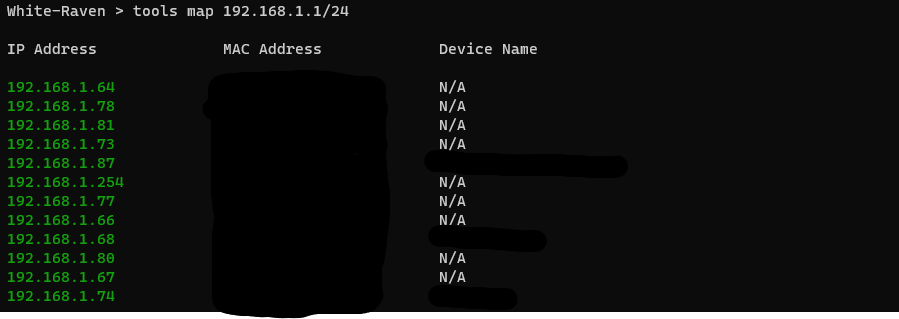
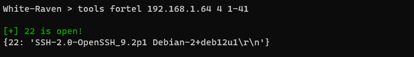
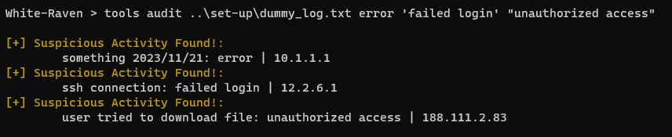

# White-Raven

<!-- Project Logo will go here -->
<!-- Project cool buttons such as languages etc. here -->
<!--
<div align="center">
  <a href="https://github.com/IvoryCoding/spiders-web">
    
  </a>
</div>

<p align="center">
    <br />
    <a href="https://github.com/IvoryCoding/spiders-web"><strong>Explore the docs »</strong></a>
    <br />
    <br />
    <a href="https://github.com/IvoryCoding/spiders-web">View Demo</a>
    ·
    <a href="https://github.com/IvoryCoding/spiders-web/issues">Report Bug</a>
    ·
    <a href="https://github.com/IvoryCoding/spiders-web/issues">Request Feature</a>
</p>
-->

# Purpose
White-Raven is a ethical hacking tool designed to be used by ethical hackers and SOC analysts. Helps automate mapping a network, intrusion detection, vulnerability searches, and more.

# Preview






# Installation

```
git clone https://github.com/White-R4V3N/White-Raven
cd White-Raven
pip install colorama
pip install scapy
```
```
chmod +x white-raven.py
./white-raven.py
      or
python white-raven.py
```

# Apporach
White-Raven is written in python for its scripting and its ease of automation. In my approach I did a lot of research into what each command needed to do and how to achieve it.

One essential tool that I wanted to psuedo create was Nmap. I had to learn how to open sockets and try to connect to the ports. From there how could I optimize and make it faster using threads.

From there I thought, "well how do I get this IP address to see running services?". I knew I had to map the network. So from there I made raven map which will map the network I am currently on.

Now I was able to see all devices connected to the network and was able to get services running on them and could search up if they were vulnerable. Looking at it from an attackers point of view. How would I be able to see if there was someone unwanted maping the network, checking ports, or even trying to access the machine through ssh or failed logins.

I wanted to create a function that would be able to open a port and take the IP address of someone accessing the port through a scan. Knowing this device doesn't have a webpage. I created a script that would allow me to create a decoy port that would capture the IP address of someone doing exactly that.

After that I wanted to see about reading logs and using python and regex to find potenial suspicious activity. The audit tool will read chosen log file and look for keywords that you define and bring those lines to the command line for your attention.

# Limitations
There are many limitations with my approach and functions as they are now. It would be nice to have decoy have potential to be moved to a different device with selected ip and port of said device that the user can upload and run. As well as the audit tool is limited to the keywords the user defines and has no way of triaging whats more important to display first over less important. An Nmap is able to show potential attacks that can be done while fortel makes the user search themselves.

My goal is to address these limitations and find ways to better the program while also knowing in doing so more limitations are bound to show up.
